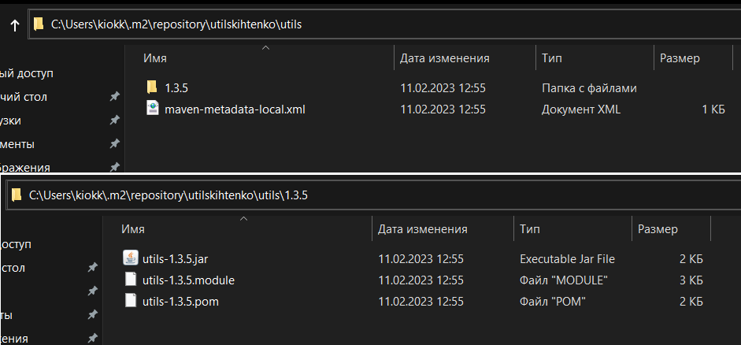

# TASK2-Gradle
### Build project
```
./gradlew build
```
### Running tests
```
gradle test --tests "org.clevertec.*"
```
### Display directories with test reports
```
gradle -q showDirs
```
### Uploading the library to the local folder /.m2
```
gradle publishToMavenLocal
```
You can find the library here

After that, the library can be used in other projects by writing 
```
dependencies {
    implementation "utilskihtenko:utils:1.3.5"
}
```
In class: ___import org.clevertec.StringUtils;___